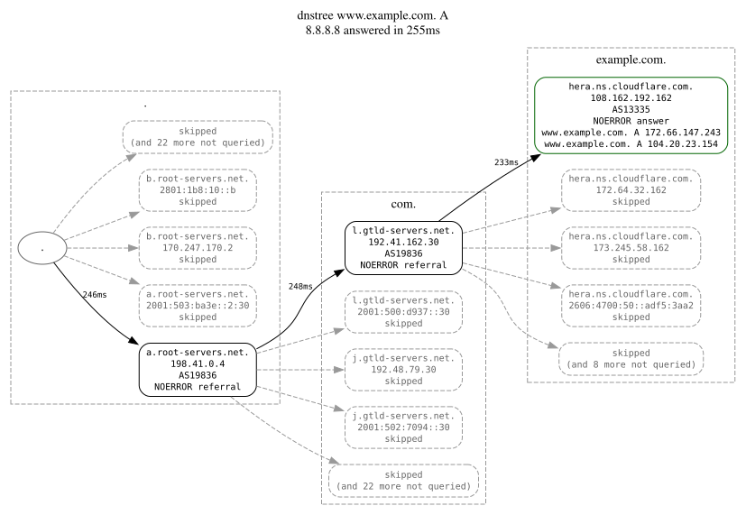
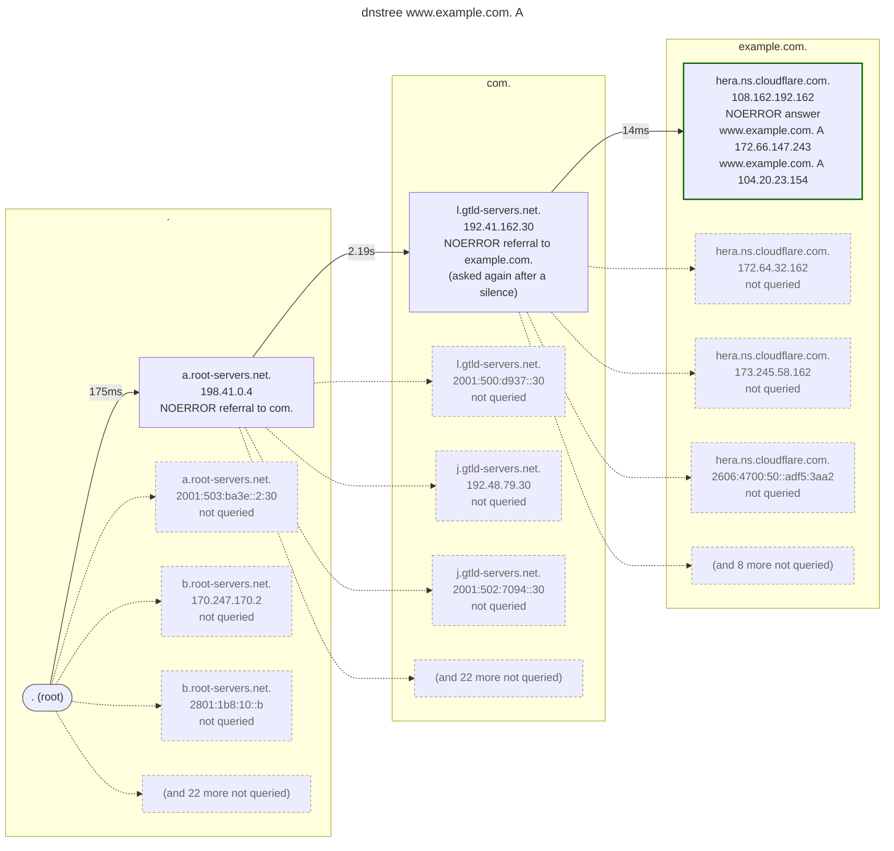

<picture>
  <source media="(prefers-color-scheme: dark)" srcset="docs/logo-dark.svg">
  
</picture>

[](https://github.com/rafaeljusto/dnstree/releases)
[](https://github.com/rafaeljusto/dnstree/actions/workflows/ci.yml)
[](LICENSE)

**[rafaeljusto.github.io/dnstree](https://rafaeljusto.github.io/dnstree/)**

Resolve a name the way a resolver does — from the root servers down, following
every referral — and draw the path it took.


```
$ dnstree www.example.com A
. (root)
├── a.root-servers.net. 198.41.0.4  AS19836  241ms  NOERROR  referral → com.
│   ├── l.gtld-servers.net. 192.41.162.30  AS19836  247ms  NOERROR  referral → example.com.
│   │   ├── hera.ns.cloudflare.com. 108.162.192.162  AS13335  233ms  NOERROR  AA
│   │   │   ├── www.example.com. 300 A 172.66.147.243
│   │   │   └── www.example.com. 300 A 104.20.23.154
│   │   ├── hera.ns.cloudflare.com. 172.64.32.162  (not queried)
│   │   ├── hera.ns.cloudflare.com. 173.245.58.162  (not queried)
│   │   ├── hera.ns.cloudflare.com. 2606:4700:50::adf5:3aa2  (not queried)
│   │   └── (and 8 more not queried)
│   ├── l.gtld-servers.net. 2001:500:d937::30  (not queried)
│   ├── j.gtld-servers.net. 192.48.79.30  (not queried)
│   ├── j.gtld-servers.net. 2001:502:7094::30  (not queried)
│   └── (and 22 more not queried)
├── a.root-servers.net. 2001:503:ba3e::2:30  (not queried)
├── b.root-servers.net. 170.247.170.2  (not queried)
├── b.root-servers.net. 2801:1b8:10::b  (not queried)
└── (and 22 more not queried)
✔ answered in 722ms · resolver in 243ms · 3 queries · 3 servers
```

`dig +trace` tells you the same story in prose. `dnstree` draws it, and says
what it found on the way: which servers were lame, which delegations are
broken, how long each hop took, which AS announces each address, and whether
the chain of trust holds.

## Installing

```
go install github.com/rafaeljusto/dnstree/v2/cmd/dnstree@latest
```

Or run it straight from a container:

```
docker run --rm ghcr.io/rafaeljusto/dnstree www.example.com A
```

Every [release](https://github.com/rafaeljusto/dnstree/releases) also carries a
binary for macOS, Linux, FreeBSD and Windows, a Debian, RPM and Alpine package
for amd64, arm64 and 32-bit arm, and a Homebrew formula. The packages install a man
page: `man dnstree`. `checksums.txt` covers every file in the release.
[`packaging/`](packaging/) says how they are built.

<details>
<summary>Installing a downloaded package</summary>

The release notes give the command for each, with the version in place of
`X.Y.Z`:

```
# Debian, Ubuntu
sudo dpkg -i dnstree_X.Y.Z_amd64.deb

# Fedora, RHEL
sudo rpm -i dnstree-X.Y.Z-1.x86_64.rpm

# Alpine
sudo apk add --allow-untrusted dnstree_X.Y.Z_x86_64.apk

# Homebrew
brew install --formula ./dnstree.rb
```

</details>

## Using it

```
dnstree [flags] NAME [TYPE]
```

`TYPE` defaults to `A`.

| Flag | What it does |
| --- | --- |
| `-x` | resolve the PTR of this address, in place of a name and a type |
| `-4`, `-6` | ask only IPv4 or only IPv6 servers; the others are drawn unqueried |
| `--udp`, `--tcp` | carry the queries over plain DNS (`--udp` is the default) |
| `--dot`, `--doh` | carry them encrypted, over TLS or HTTPS |
| `--fallback` | let plain DNS pick up a hop the transport could not |
| `--all` | ask every nameserver of a zone, not just the first that answers |
| `--dnssec` | ask for signatures and follow the chain of trust |
| `--check-ns` | ask the zone that answered for its own NS set, and compare it with the delegation |
| `--check-ds` | ask the zone for its CDS and CDNSKEY and compare them with the parent's DS |
| `--serial` | ask every nameserver of the zone which copy of it they serve, and compare |
| `--nsid` | ask each server which of itself answered, and draw it beside the address |
| `--cookie` | send each server a DNS cookie (RFC 7873), and say how it answered |
| `--qmin` | ask each zone for no more of the name than it needs, the way resolvers do (RFC 9156) |
| `--subnet` | ask as though from this client subnet, and say what each server made of it |
| `--no-asn` | skip the origin AS lookups |
| `--no-compare` | skip the question put to a recursive resolver, and the comparison with it |
| `--format` | `tree` (the default), `ascii`, `emoji`, `json`, `dot`, `mermaid`, `openmetrics` or `web` |
| `--web-addr`, `--no-browser` | where `--format web` serves the page, and whether a browser is opened at it |
| `--live` | draw the tree as the walk makes it, hop by hop |
| `--watch` | walk again this often, and say only what changed since the walk before |
| `--explain` | say in sentences what the walk came to, under the tree |
| `--diff` | say what has changed since the last walk of the same question |
| `--expect` | require this of the walk, and exit 4 where it does not hold; repeat it |
| `--from` | draw a walk `--format json` saved, from a file or `-`, instead of making one |
| `--color` | `auto` (the default: only on a terminal, and off where `NO_COLOR` is set or `TERM` is unset or `dumb`), `always` or `never` |
| `--timeout`, `--retries` | how long one query may take (2s), and how often to ask again after a silence (once) |
| `--max-depth`, `--max-queries`, `--max-cname` | the budgets that keep a walk finite: 16 zone cuts, 64 queries, 8 aliases |
| `--port` | the port nameservers are asked on (53) |
| `--root-hints` | where the walk starts, instead of the built-in hints |
| `--trust-anchors` | the DS records to trust, instead of the built-in ones |
| `--root` | one server to start from, instead of a hints file; repeat it for more |
| `--resolver` | a recursive server to use, instead of the host's own; repeat it to ask several |
| `--tls-ca`, `--tls-insecure` | how `--dot` and `--doh` verify a server, or that they do not |
| `--config`, `--no-config` | take the defaults from this file, or from no file at all |
| `--debug` | report every hop on stderr as it is made |
| `--schema` | print the JSON Schema of `--format json` and stop |
| `--version` | print the version and stop |

### Reverse lookups

`-x ADDR` asks for the PTR record of an address, the way `dig -x` does:
`192.0.2.1` is asked as `1.2.0.192.in-addr.arpa.`, and an IPv6 address nibble
by nibble under `ip6.arpa.`. It takes the place of the name and the type. The
reverse tree is delegated like any other, only more deeply, and its
nameservers are usually named somewhere else entirely, so a reverse walk is
where the side walks that resolve a nameserver's own name are most often seen.
A delegation below a /24 (RFC 2317) arrives as an alias, and is followed.

<details>
<summary>The walk to the PTR of 8.8.8.8</summary>

```
$ dnstree -x 8.8.8.8 --no-asn
. (root)
├── a.root-servers.net. 198.41.0.4  164ms  NOERROR  referral → in-addr.arpa.
│   ├── f.in-addr-servers.arpa. 193.0.9.1  244ms  NOERROR  referral → 8.in-addr.arpa.
│   │   ├── . (root)  (resolving r.arin.net.)
│   │   │   ├── a.root-servers.net. 198.41.0.4  178ms  NOERROR  referral → net.
│   │   │   │   ├── m.gtld-servers.net. 192.55.83.30  178ms  NOERROR  referral → arin.net.
│   │   │   │   │   ├── ns1.arin.net. 199.212.0.108  149ms  NOERROR  AA
│   │   │   │   │   │   └── r.arin.net. 43200 A 199.180.180.63
│   │   │   │   │   ├── ns1.arin.net. 2001:500:13::108  (not queried)
│   │   │   │   │   ├── ns2.arin.net. 199.71.0.108  (not queried)
│   │   │   │   │   ├── ns2.arin.net. 2001:500:31::108  (not queried)
│   │   │   │   │   └── (and 4 more not queried)
│   │   │   │   ├── m.gtld-servers.net. 2001:501:b1f9::30  (not queried)
│   │   │   │   ├── k.gtld-servers.net. 192.52.178.30  (not queried)
│   │   │   │   ├── k.gtld-servers.net. 2001:503:d2d::30  (not queried)
│   │   │   │   └── (and 22 more not queried)
│   │   │   ├── a.root-servers.net. 2001:503:ba3e::2:30  (not queried)
│   │   │   ├── b.root-servers.net. 170.247.170.2  (not queried)
│   │   │   ├── b.root-servers.net. 2801:1b8:10::b  (not queried)
│   │   │   └── (and 22 more not queried)
│   │   └── r.arin.net. 199.180.180.63  172ms  NOERROR  referral → 8.8.8.in-addr.arpa.
│   │       ├── . (root)  (resolving ns1.google.com.)
│   │       │   ├── a.root-servers.net. 198.41.0.4  150ms  NOERROR  referral → com.
│   │       │   │   ├── l.gtld-servers.net. 192.41.162.30  191ms  NOERROR  referral → google.com.
│   │       │   │   │   ├── ns2.google.com. 2001:4860:4802:34::a  63ms  NOERROR  AA
│   │       │   │   │   │   └── ns1.google.com. 345600 A 216.239.32.10
│   │       │   │   │   ├── ns2.google.com. 216.239.34.10  (not queried)
│   │       │   │   │   ├── ns1.google.com. 2001:4860:4802:32::a  (not queried)
│   │       │   │   │   ├── ns1.google.com. 216.239.32.10  (not queried)
│   │       │   │   │   └── (and 4 more not queried)
│   │       │   │   ├── l.gtld-servers.net. 2001:500:d937::30  (not queried)
│   │       │   │   ├── j.gtld-servers.net. 192.48.79.30  (not queried)
│   │       │   │   ├── j.gtld-servers.net. 2001:502:7094::30  (not queried)
│   │       │   │   └── (and 22 more not queried)
│   │       │   ├── a.root-servers.net. 2001:503:ba3e::2:30  (not queried)
│   │       │   ├── b.root-servers.net. 170.247.170.2  (not queried)
│   │       │   ├── b.root-servers.net. 2801:1b8:10::b  (not queried)
│   │       │   └── (and 22 more not queried)
│   │       └── ns1.google.com. 216.239.32.10  58ms  NOERROR  AA
│   │           └── 8.8.8.8.in-addr.arpa. 86400 PTR dns.google.
│   ├── f.in-addr-servers.arpa. 2a13:27c0:30::1  (not queried)
│   ├── b.in-addr-servers.arpa. 199.253.183.183  (not queried)
│   ├── b.in-addr-servers.arpa. 2001:500:87::87  (not queried)
│   └── (and 8 more not queried)
├── a.root-servers.net. 2001:503:ba3e::2:30  (not queried)
├── b.root-servers.net. 170.247.170.2  (not queried)
├── b.root-servers.net. 2801:1b8:10::b  (not queried)
└── (and 22 more not queried)
✔ answered in 1.5s · resolver in 9ms · 10 queries · 8 servers
```

</details>

### Defaults

Flags you always type belong in a file instead. `dnstree` reads the first of
`$DNSTREE_CONFIG`, `$XDG_CONFIG_HOME/dnstree/config` (`~/.config/dnstree/config`
where that is unset, `%AppData%\dnstree\config` on Windows) and `~/.dnstreerc`:

```
# ~/.dnstreerc
format = emoji
dnssec
timeout = 3s
```

One long flag name per line, with the value it takes. `name value` works as well
as `name = value`, the dashes of a pasted command line are allowed and ignored,
and a flag that stands on its own needs no value. A line opening with `#` is a
comment; a `#` partway along a line is part of the value, so a setting and what
it is for go on separate lines. A name that is not a flag, or one missing the
value it takes, is reported against the line that wrote it, and so are `config`,
`no-config`, `version`, `schema`, `from` and `x`: those six ask something of the
run rather than set a default for it.

> [!NOTE]
> A file named outright — by `$DNSTREE_CONFIG` or by `--config` — has to be
> there, and a missing one is an error. The two conventional locations are
> read if they exist.

The command line wins over the file, so `--format ascii` overrides the line
above and `--dnssec=false` turns a flag it set back off. Flags that answer one
question in different ways give way as a group, rather than colliding: naming
any of `--udp`, `--tcp`, `--dot` or `--doh` drops whichever transport the file
chose, and so it goes for `-4` and `-6`, for `--root` and `--root-hints`, and
for `--tls-ca` and `--tls-insecure`. `--format json`, `--format dot`,
`--format mermaid`, `--format openmetrics` and `--format web` drop a `live` and
a `watch` the file set, since all five are written once at the end and leave
neither anything to draw nor anything to change; all but `web` drop an
`explain` and a `diff` as well, being read by a program that has the whole
trace already. A
format that serves no page drops a `web-addr` and a `no-browser` it set, and
`--from` drops a `live`, a `watch` and a `diff`, which are about walks being
made. `--config FILE` reads somewhere else, and `--no-config` reads nowhere.

`root` is the one line worth repeating: a file may carry as many as the walk
should start from, in the order they are written. One `--root` on the command
line replaces every one of them, rather than adding to them, and so does
`--root-hints`.

> [!TIP]
> [`dnstreerc.example`](dnstreerc.example) is a file of every setting worth
> making, annotated and commented out. Copy it and uncomment what you want.

### Pointing it somewhere else

Nothing about the walk assumes the real root. `--root` names the servers it
starts from, one flag each, and each may carry the port the server listens on:

```
$ dnstree --root a.root-servers.net@127.0.0.1:5353 --port 5354 \
    --trust-anchors ./anchors.xml --dnssec www.test A
```

A root that carries no port is asked on `--port`, and so is everything reached
by glue below it — glue carries addresses and never ports, so a hierarchy on
one host wants its root on a port of its own and the rest on `--port`.
`--root` and `--root-hints` say the same thing two ways, so only one of them
may be given. `--trust-anchors` takes IANA's `root-anchors.xml` or DS records
in presentation format.

`--resolver ADDR` points everything that needs a recursive server at one of
your own: the origin AS lookups and the timed comparison. `--no-asn` and
`--no-compare` skip either; asking for both is refused, since it leaves
`--resolver` nothing to do. `--asn-resolver` is its older name. One on the
command line replaces every one the file chose. Without it, the comparison
asks the first nameserver in `/etc/resolv.conf`; where there is none, as on
Windows, nothing is compared until one is named.

The origin AS lookups are TXT queries to Team Cymru's `origin.asn.cymru.com`
zones, made through the host's resolver or the first `--resolver`; `--no-asn`
turns them off.

For `--dot` and `--doh`, `--tls-ca FILE` verifies against a CA of your own.

> [!CAUTION]
> `--tls-insecure` verifies nothing at all. It is there to reach a server
> holding a test certificate, and it is worth nothing anywhere else.

### Exit codes

| Code | Meaning |
| --- | --- |
| 0 | something answered |
| 1 | the command line, a file it names, or the address `--format web` serves on could not be used |
| 2 | the walk ended without an answer |
| 3 | the chain of trust is broken |
| 4 | an expectation given with `--expect` was not met |

The tree, the summary, `--explain` and the address `--format web` serves on go
to stdout; errors, `--debug` and an unmet expectation go to stderr. `-h` prints
the usage on stderr and exits 1.

### DNSSEC

`--dnssec` follows the chain from the trust anchors down: the DS each parent
publishes, the keys each child serves, and the signatures over the answer.

```
$ dnstree --dnssec --no-asn cloudflare.com A
. (root)  [secure RSASHA256/SHA256]
├── a.root-servers.net. 198.41.0.4  243ms  NOERROR  DO  referral → com.  [secure ECDSAP256SHA256/SHA256]
│   ├── a.root-servers.net. 198.41.0.4  251ms  NOERROR  AA DO  (DNSKEY of .)
│   ├── l.gtld-servers.net. 192.41.162.30  262ms  NOERROR  DO  referral → cloudflare.com.  [secure ECDSAP256SHA256/SHA256]
│   │   ├── l.gtld-servers.net. 192.41.162.30  257ms  NOERROR  AA DO  (DNSKEY of com.)
│   │   ├── ns3.cloudflare.com. 162.159.0.33  240ms  NOERROR  AA DO  [secure ECDSAP256SHA256]
│   │   │   ├── cloudflare.com. 300 A 104.16.132.229
│   │   │   ├── cloudflare.com. 300 A 104.16.133.229
│   │   │   └── ns3.cloudflare.com. 162.159.0.33  235ms  NOERROR  AA DO  (DNSKEY of cloudflare.com.)
│   │   ├── ns3.cloudflare.com. 162.159.7.226  (not queried)
│   │   ├── ns3.cloudflare.com. 2400:cb00:2049:1::a29f:21  (not queried)
│   │   ├── ns3.cloudflare.com. 2400:cb00:2049:1::a29f:7e2  (not queried)
│   │   └── (and 16 more not queried)
│   ├── l.gtld-servers.net. 2001:500:d937::30  (not queried)
│   ├── j.gtld-servers.net. 192.48.79.30  (not queried)
│   ├── j.gtld-servers.net. 2001:502:7094::30  (not queried)
│   └── (and 22 more not queried)
├── a.root-servers.net. 2001:503:ba3e::2:30  (not queried)
├── b.root-servers.net. 170.247.170.2  (not queried)
├── b.root-servers.net. 2801:1b8:10::b  (not queried)
└── (and 22 more not queried)
✔ answered in 1.5s · resolver in 14ms · 6 queries · 3 servers
```

A zone whose parent proves it publishes no DS reads `[insecure]`, and everything
below it stays that way. A parent that publishes neither a DS nor the signed
proof that it has none is not taken at its word: dropping the DS out of a
referral is all it would take to walk the chain off the secure path. A link that
cannot be checked at all — an algorithm this build does not know — reads
`[indeterminate]`, which is not the same as `[bogus]`.

Denial of existence is proved. NSEC and NSEC3 are read, opt-out included, so an
answer with nothing in it is checked like any other: an NXDOMAIN has to show the
gap the name falls in and the gap the wildcard would have answered from, a
NODATA has to name the types the name does hold, and an answer a wildcard was
stretched over has to show there was nothing closer to answer with. A denial
that rests on an opt-out range reads `[insecure]`: the range may be hiding an
unsigned delegation, so it proves only that the name is not signed.

A registry that serves its own domains from the machines of its ccTLD answers
for a child zone with no referral to it, so the cut is invisible from the walk.
The signatures name the zone that made them, and the same server holds the
parent side of the cut, so it is asked for the child's DS — an aside reading
`(DS of registro.br.)` — and the chain crosses the cut before the answer is
checked.

A chain that holds today can stop holding on a schedule. Every signature is
made to last a while, and a zone whose signer has stopped goes on validating
until the first of them runs out, and then fails all at once. A signer re-signs
with a quarter or more of a signature's life still ahead of it, so a verdict
resting on one with less than a fifth of its life left says when it runs out —
`[secure ECDSAP256SHA256, expires in 2d3h]` — and `--explain` says what happens
then. The time left is read against when the walk was made, which is also what
a walk drawn again with `--from` reads it against. `--expect fresh` holds a
script to the same thing; see [Asking rather than reading](#asking-rather-than-reading).

### What a server said about its answer

An rcode says what happened. The extended errors of RFC 8914 say why, and they
are the only thing in a reply that tells an answer somebody kept back from an
answer that was never there. Drawn against the test servers, whose last one
refuses with a reason:

```
$ dnstree blocked.example.com A
. (root)
└── a.root-servers.net. 192.0.2.1  690µs  NOERROR  referral → com.
    └── ns.com. 192.0.2.2  430µs  NOERROR  referral → example.com.
        └── ns1.example.com. 192.0.2.53  370µs  REFUSED  filtered  ede Prohibited (18): not from this network
✘ filtered in 2ms · 3 queries · 3 servers
```

Without the code on the end that hop reads as a lame server — one with no
business serving the zone, which is a fault to take to whoever runs it. With it,
the server is working exactly as somebody configured it, and the fault, if there
is one, is not the zone's. The same goes for an NXDOMAIN carrying `Blocked (15)`: the
name is not missing, it is being denied, and a walk that ends that way reports
`filtered` rather than `no answer`.

A code that claims nothing of the sort — a stale answer served from a cache,
say — is carried on the hop and changes nothing else. Every code reaches
`--format json` as `extended`, with a `withheld` flag on the ones that mean
somebody decided the answer, so a script need not carry the list itself.

Exit code 2 covers a filtered walk, as it does any other walk that ends without
an answer.

### ECH, and what makes it worth anything

Encrypted client hello hides the name a client is about to connect to. The
configuration that does the hiding is published in DNS, in the HTTPS record of
the name itself, which means the thing being protected travels in the same
answer as the protection. Anything that can rewrite that answer can drop the
configuration out of it, and a client that finds none does not fail: it connects
the old way and sends the name in the clear.

So `dnstree` reads the service parameters of an HTTPS or SVCB record rather than
only printing them, marks the records that publish a configuration, and says
when nothing vouched for the answer that carried it:

```
$ dnstree --dnssec www.example.com HTTPS
...
└── ns3.example.com. 192.0.2.53  18ms  NOERROR  AA DO  [secure ECDSAP256SHA256]
    └── www.example.com. 300 HTTPS 1 . alpn="h2,h3" ech="AEX+DQBB..."  [ech]
```

> [!WARNING]
> Without `--dnssec`, or against a zone whose answer comes back `insecure` or
> `bogus`, the same record earns a warning: the configuration is there, and
> nothing here can tell whether it is the one the zone published.

The parameters are in `--format json` under `service`, `ech` included.

### Asking from somewhere else

A server that answers by where the question came from — which is every CDN —
tells a walk from your desk about your desk. `--subnet` asks it the question
somebody else would be asking:

```
$ dnstree --subnet 203.0.113.0/24 www.example.com A
...
└── ns3.example.com. 192.0.2.53  18ms  NOERROR  AA  ecs scope /24
    └── www.example.com. 60 A 198.51.100.7
```

`ecs scope /24` is the server saying it used the whole prefix to choose that
answer, so somebody else in that /24 gets the same one. A scope of `/0` is the
server saying the answer is the same everywhere, and a hop that echoes nothing
at all ignored the subnet, which earns a warning: what came back is what that
server tells everybody, and the question went unanswered.

A bare address is read as the /24 or /56 around it, since the point is the
network and not the machine.

> [!IMPORTANT]
> The subnet is sent to every server on the way down, which is more than the
> root servers need to know about where you are, so it is never sent unless it
> is asked for.

### Whether the parent and the child agree

The delegation a walk follows is the parent's word for who serves the zone. The
zone keeps its own NS RRset, and nothing above it ever reads that one, so the
two drift apart quietly: a nameserver retired in the zone and left in the
registry answers nothing, and one added to the zone and never registered is
never asked. `--check-ns` puts the question to the zone that answered and holds
the two lists against each other:

```
$ dnstree --check-ns --no-asn www.example.com A
...
│   │   ├── hera.ns.cloudflare.com. 108.162.192.162  222ms  NOERROR  AA
│   │   │   ├── www.example.com. 300 A 172.66.147.243
│   │   │   ├── www.example.com. 300 A 104.20.23.154
│   │   │   └── hera.ns.cloudflare.com. 108.162.192.162  224ms  NOERROR  AA  (parent/child NS check)
...
✔ answered in 936ms · resolver in 245ms · 4 queries · 3 servers
```

The check rides in as a hop of its own, marked for what it is, so the query it
cost is visible in the tree rather than hidden in the count. Two lists that
match are worth no room and get none. Where they differ, the walk says so above
the summary, in whichever direction it found:

> test. delegates to ns3.test., which the zone itself does not list

> test. lists ns4.test., which the delegation does not carry

Neither is fatal — the name still resolves, which is exactly why nobody notices
— and both are a fault to take to whoever holds the other half. A zone that
answers the question with no NS records of its own is reported too, since a zone
that cannot name its own nameservers is a stranger thing than a list that has
drifted.

It costs one query, asked of the server that answered the question, and it is
off unless asked for.

The zone's own NS set carries a TTL of its own, too, and it is rarely the
parent's: the parent's is often the registry's to choose. Resolvers differ over
whose copy they keep once they have seen both, so a change of nameservers takes
the longer of the two to reach everybody. `--explain` says so where they differ:

```
$ dnstree --check-ns --explain --no-asn www.example.com A
...
✔ answered in 384ms · resolver in 21ms · 4 queries · 3 servers

...
· the parent hands out the nameservers of example.com. for 2 days and the zone gives its own for 1 day, so a change of nameservers takes up to 2 days to reach every resolver
```

### What the zone asks its parent

A zone changes the DS that vouches for it by asking: it publishes the DS it
wants in a CDS record, or the key in a CDNSKEY (RFC 7344), and its parent picks
the request up when it next looks. A key rollover is exactly that, which makes a
request the parent has not acted on a rollover stuck halfway — and the chain is
secure all the while, so nothing else says so. `--check-ds` asks the zone the
walk ends in for both, and holds them against the DS its parent handed out:

```
$ dnstree --dnssec --check-ds --no-asn cloudflare.com A
. (root)  [secure RSASHA256/SHA256]
├── a.root-servers.net. 198.41.0.4  151ms  1174 of 1232 bytes  NOERROR  DO  referral → com.  [secure ECDSAP256SHA256/SHA256]
│   ├── a.root-servers.net. 198.41.0.4  491ms  NOERROR  AA DO  (truncated over udp; DNSKEY of .)
│   ├── l.gtld-servers.net. 192.41.162.30  186ms  NOERROR  DO  referral → cloudflare.com.  [secure ECDSAP256SHA256/SHA256]  cds matches the ds
│   │   ├── l.gtld-servers.net. 192.41.162.30  214ms  NOERROR  AA DO  (DNSKEY of com.)
│   │   ├── ns3.cloudflare.com. 162.159.0.33  8.2ms  NOERROR  AA DO  [secure ECDSAP256SHA256]
│   │   │   ├── cloudflare.com. 300 A 104.16.133.229
│   │   │   ├── cloudflare.com. 300 A 104.16.132.229
│   │   │   ├── ns3.cloudflare.com. 162.159.0.33  12ms  NOERROR  AA DO  (DNSKEY of cloudflare.com.)
...
✔ answered in 1.1s · resolver in 14ms · 8 queries · 3 servers
```

Beside the verdict of the cut it reads `cds matches the ds`, `no cds`, or one of
the three things worth a warning: a zone asking for a key the parent does not
publish, a zone asking for no DS at all (RFC 8078), which leaves it unsigned
once the parent acts, and a CDS and a CDNSKEY describing different keys, which a
parent acts on neither of. A parent holding a SHA-1 digest beside the SHA-256
one asked for holds the same key, and is not a rollover.

The request counts only once the zone's own keys have signed it, the way a
parent checks it, so `--check-ds` needs `--dnssec` — a file of defaults that sets
it is heeded by the runs that check signatures, and left alone by the rest — and
a zone the chain did not reach secure reads `cds unchecked`. A zone that crosses into a child served by
the same machines, with no referral, is checked against the DS fetched to cross
it. It costs two queries, asked of the server that answered.

### Whether they all have the same zone

A walk stops at the first nameserver that answers, which is what a resolver
does and what makes a secondary left behind by a zone transfer invisible: it is
reachable, it is authoritative, and it answers the question correctly out of an
older zone. `--serial` asks every one of them which copy it is holding:

```
$ dnstree --serial --no-asn wikipedia.org A
...
│   │   ├── ns2.wikimedia.org. 198.35.27.27  246ms  NOERROR  AA
│   │   │   ├── wikipedia.org. 180 A 185.15.59.224
│   │   │   ├── ns2.wikimedia.org. 198.35.27.27  274ms  NOERROR  AA  (SOA of wikipedia.org.: 2026060420)
│   │   │   ├── ns2.wikimedia.org. 2a02:ec80:53::1  14ms  NOERROR  AA  (SOA of wikipedia.org.: 2026060420)
│   │   │   ├── ns0.wikimedia.org. 208.80.154.238  340ms  NOERROR  AA  (SOA of wikipedia.org.: 2026060420)
│   │   │   ├── ns0.wikimedia.org. 2620:0:861:53::1  134ms  NOERROR  AA  (SOA of wikipedia.org.: 2026060420)
│   │   │   ├── ns1.wikimedia.org. 208.80.153.231  358ms  NOERROR  AA  (SOA of wikipedia.org.: 2026060420)
│   │   │   └── ns1.wikimedia.org. 2620:0:860:53::1  158ms  NOERROR  AA  (SOA of wikipedia.org.: 2026060420)
...
✔ answered in 1.3s · resolver in 249ms · 9 queries · 8 servers
```

Six addresses, one zone, and nothing to report. Where they do not all hold the
same copy, the walk says so above the summary, naming who holds what:

> the nameservers of test. are serving different copies of it: 2 at ns1.test., 1 at ns2.test.

Which of the serials is the newer one is deliberately not claimed. Serial
arithmetic wraps around (RFC 1982), so the larger number is not reliably the
later zone, and a tool that guessed would send somebody to restart the wrong
server.

It costs a query per nameserver and is off unless asked for. It does not need
`--all`: the sweep is one cheap question to each of them, rather than the whole
resolution done over again.

`--all` sees the other half of the same thing, and needs no flag of its own to
say it. Where it has put the question itself to every nameserver of a zone, two
of them answering differently is worth a line:

> the nameservers of test. do not answer www.test. A alike: 192.0.2.10 at ns1.test., 192.0.2.99 at ns2.test.

Answers are held against each other as sets, so a nameserver rotating an RRset
between one question and the next is not a nameserver that disagrees. A real
difference is not by itself a fault — a zone served by something that answers by
where the question came from will do this honestly, and so will an RRset caught
halfway through a change — but nothing else in a trace says it at all.

### Which machine answered

An address is not a server. `a.root-servers.net.` is one address announced from
hundreds of places at once, and so is every nameserver of every large zone, so
a hop that says `198.41.0.4` has named a network and not a machine. `--nsid`
asks each server for the identifier it publishes for itself (RFC 5001) and
draws it beside the address:

```
$ dnstree --nsid --no-asn www.example.com A
. (root)
├── a.root-servers.net. 198.41.0.4  @a.r.ams5.nlams-0  259ms  NOERROR  referral → com.
│   ├── l.gtld-servers.net. 192.41.162.30  @nnn1-ams5  252ms  NOERROR  referral → example.com.
│   │   ├── hera.ns.cloudflare.com. 108.162.192.162  @52m278  239ms  NOERROR  AA
│   │   │   ├── www.example.com. 300 A 104.20.23.154
│   │   │   └── www.example.com. 300 A 172.66.147.243
...
✔ answered in 750ms · resolver in 258ms · 3 queries · 3 servers
```

Two hops to the one address can come back with two identifiers, which is not a
contradiction: it is two machines, and it is the answer to why one of them is
slow and the other is not, or why one of them is serving an older zone. It
rides along on queries that are being made anyway and costs none of its own.

The identifier is opaque bytes that the server alone chooses. Operators write
names into them, and those are drawn as names; anything else is drawn as the
hex it arrived as, and an identifier longer than a line has room for is cut.
A server that publishes none says nothing, which is most of them below the
root, and its hop reads as it would without the flag.

### Which servers support DNS cookies

Most DNS travels over UDP, where anyone can send a packet claiming to be from
anywhere. A DNS cookie (RFC 7873) is the cheap fix: the client sends a random
value, the server answers with it and a value of its own, and an answer that
does not carry the client's value is not an answer to that client. `--cookie`
sends one to every server and says on each hop how it answered:

```
$ dnstree --cookie --no-asn --no-compare --explain www.isc.org A
. (root)
├── a.root-servers.net. 198.41.0.4  247ms  NOERROR  referral → org.  no cookie
│   ├── a2.org.afilias-nst.info. 199.249.112.1  233ms  NOERROR  referral → isc.org.  no cookie
│   │   ├── ns1.isc.org. 149.20.2.26  366ms  NOERROR  AA  cookie
│   │   │   ├── www.isc.org. 300 A 151.101.3.42
...
✔ answered in 849ms · 3 queries · 3 servers

· www.isc.org. A is 151.101.131.42, 151.101.195.42, 151.101.3.42 and 1 more, answered by ns1.isc.org. for isc.org.
· a cache may hold this answer for 5 minutes, and the delegation to isc.org. for 1 hour
· 2 servers answered without a dns cookie, which is allowed and leaves nothing to tell a forged answer from a real one: a.root-servers.net. and a2.org.afilias-nst.info.
```

| On the hop | What the server did |
| --- | --- |
| `cookie` | sent our client cookie back with one of its own |
| `no cookie` | sent none back, which is allowed |
| `cookie not ours` | sent back a client cookie other than the one sent: broken, or the answer is not the server's, and the walk warns |
| `cookie malformed` | sent a cookie of a length no cookie has |
| `cookie rejected` | answered `BADCOOKIE` even to the cookie it handed out itself |

The walk behaves as a client that supports cookies: a server is sent back the
cookie it handed out, and one that answers `BADCOOKIE` is asked again with the
cookie that came with it, once. Each server gets a client cookie of its own,
made fresh for the run, so no two of them can follow the walk between them
(RFC 9018). Cookies go on queries over UDP and TCP; over DoT and DoH the
handshake already proves the address, so nothing is sent and nothing is said.
A cookie never changes the exit code.

### Asking only what each zone needs

A walk asks every server the whole name, the way `dig +trace` does. Resolvers
stopped doing that years ago: they ask each zone for one label more than it
already has, so the root hears about `com.` and never about `www.example.com.`
(RFC 9156). `--qmin` walks that way, and every hop that asked less than the
whole name says what it asked instead:

```
$ dnstree --qmin --no-asn www.example.com A
. (root)
├── a.root-servers.net. 198.41.0.4  164ms  NOERROR  referral → com.  (minimised to com.)
│   ├── l.gtld-servers.net. 192.41.162.30  221ms  NOERROR  referral → example.com.  (minimised to example.com.)
│   │   ├── hera.ns.cloudflare.com. 108.162.192.162  13ms  NOERROR  AA
│   │   │   ├── www.example.com. 300 A 172.66.147.243
│   │   │   └── www.example.com. 300 A 104.20.23.154
│   │   ├── hera.ns.cloudflare.com. 172.64.32.162  (not queried)
│   │   ├── hera.ns.cloudflare.com. 173.245.58.162  (not queried)
│   │   ├── hera.ns.cloudflare.com. 2606:4700:50::adf5:3aa2  (not queried)
│   │   └── (and 8 more not queried)
│   ├── l.gtld-servers.net. 2001:500:d937::30  (not queried)
│   ├── j.gtld-servers.net. 192.48.79.30  (not queried)
│   ├── j.gtld-servers.net. 2001:502:7094::30  (not queried)
│   └── (and 22 more not queried)
├── a.root-servers.net. 2001:503:ba3e::2:30  (not queried)
├── b.root-servers.net. 170.247.170.2  (not queried)
├── b.root-servers.net. 2801:1b8:10::b  (not queried)
└── (and 22 more not queried)
✔ answered in 401ms · resolver in 12ms · 3 queries · 3 servers
```

Below a zone cut it goes on a label at a time — an empty name on the way answers
NODATA, and the walk asks one label further — so a name deep under its zone
costs a query for each label. The point of asking this way is what it finds: a
server that answers NXDOMAIN for a name only because nothing is at it yet, which
RFC 8020 reads as nothing being below it either. A resolver that minimises
stops there; one that does not never asks the question. `--qmin` asks the whole
name again when it meets one, the way resolvers fall back, and says under the
tree which server did it and for which name.

### How much room an answer had

Every hop records how big the answer was and how big it was allowed to be: the
bytes that arrived, against the EDNS0 buffer the query advertised — 512 for a
query that carried none, and nothing at all over TCP, DoT and DoH, where a
single answer is not bounded that way.

Nearly always that is worth no room on the line and gets none. A hop that has
all but filled its datagram is drawn, because it is the one thing in a walk
that is about to break and has not broken yet:

```
$ dnstree --dnssec --no-asn www.example.com A
. (root)  [secure RSASHA256/SHA256]
├── a.root-servers.net. 198.41.0.4  244ms  1175 of 1232 bytes  NOERROR  DO  referral → com.  [secure ECDSAP256SHA256/SHA256]
│   ├── a.root-servers.net. 198.41.0.4  718ms  NOERROR  AA DO  (truncated over udp; DNSKEY of .)
│   ├── l.gtld-servers.net. 192.41.162.30  242ms  NOERROR  DO  referral → example.com.  [secure ECDSAP256SHA256/SHA256]
...
```

That is the real root, answering a signed referral with 57 bytes to spare. One
more record in it — an address added, a key rolled — and the answer stops
fitting. Every resolver that asks then pays a second round trip to fetch it over
TCP, and the ones that cannot reach the server over TCP get no answer at all.
Nothing is wrong with it today, which is why nothing else reports it.

The hop below it is the same thing after it has happened: the keys of the root
did not fit, and `(truncated over udp)` is the second round trip being paid.

> [!NOTE]
> `--dnssec` is what makes the figure the one that matters. The same referral
> asked for without it comes back 335 bytes lighter, with room to spare, because
> none of the signatures are in it — and a resolver that validates does ask for
> them. `--explain` on a walk that did not says so, rather than leave the reader
> a margin that is not theirs.

Both sizes reach `--format json` as `size_bytes` and `limit_bytes`, with a
`tight` flag on the hops that have no room left, so a script need not carry the
margin itself.

### Against your resolver

Every walk also puts the question to a recursive resolver — the host's own, or
whichever `--resolver` names — and keeps the answer as well as the clock. When
the two disagree, the tree says so, under the walk and above the summary:

```
$ dnstree intranet.example.com A
...
differs: 192.168.1.1 answers 10.4.2.9, the walk found 203.0.113.80
✔ answered in 412ms · resolver in 3ms (differs) · 4 queries · 4 servers
```

> [!IMPORTANT]
> A difference is not by itself a wrong answer. The two questions were asked
> from different places, so a CDN will honestly answer them differently, and a
> short TTL can turn over between one and the other. What it might instead be is
> the reason the line is there: a split horizon, a filtering resolver, a policy
> answering in the zone's place. `dnstree` reports the difference and leaves the
> reading to you.

Agreement is worth no room and gets none. `--no-compare` turns the whole thing
off, which is also the only way to keep the name being resolved from reaching a
resolver at all.

### Asking from several places at once

Repeat `--resolver` and the question goes to all of them at the same moment.
Two resolvers that answer differently are two views of one name, and which of
them somebody gets depends on nothing but which resolver they happen to use:

```
$ dnstree --resolver 1.1.1.1 --resolver 8.8.8.8 --resolver 9.9.9.9 --explain akamai.com A
...
differs: 1.1.1.1 answers 2.19.176.208, 2.19.176.211, the walk found 2.18.27.18, 2.18.27.35
differs: 9.9.9.9 answers 2.16.145.4, 2.16.145.8, the walk found 2.18.27.18, 2.18.27.35
✔ answered in 1.4s · resolvers in 282ms-312ms (2 of 3 differ) · 6 queries · 5 servers

· akamai.com. A is 2.18.27.18 and 2.18.27.35, answered by a5-66.akam.net. for akamai.com.
· a cache may hold this answer for 20 seconds, and the delegation to akamai.com. for 2 days
· 1.1.1.1 and 9.9.9.9 answered this question differently, which a name whose answer is tailored to where it is asked from does honestly, and nothing else should
```

Each one that disagreed is named on a line of its own, since two resolvers can
disagree with the walk for two different reasons. The summary says how far apart
they were and how many of them differed; where they all agree it says only the
range, because agreement is what the reader is expecting.

What each of them has left on its copy is read too, which is what says whether
an answer has reached everybody yet: a resolver that had to go and fetch the
answer hands back the zone's lifetime entire, and one still serving an older
answer says how long it will go on doing so.

> [!TIP]
> This pairs with `--subnet`, which asks every one of them the question as
> though it came from somebody else's network. Between them they are the two
> halves of "does this name look the same from where my users are".

The origin AS lookups go to the first `--resolver` named: they need somewhere to
ask rather than a poll. There is deliberately no shorthand for "the public
resolvers" — that would put a list of somebody else's addresses in the binary
and send the name being looked up to all of them. A set worth having every day
belongs in the file of defaults, which may carry a `resolver` line for each.

### Asking rather than reading

Everything above is for a person looking at a resolution. `--expect` is for a
script that already knows what the answer should be and wants to be told when
it is not:

```
$ dnstree --expect 203.0.113.8 www.example.com A
...
✔ answered in 759ms · resolver in 244ms · 3 queries · 3 servers
expected 203.0.113.8, got 104.20.23.154 and 172.66.147.243

$ echo $?
4
```

It takes one of the words that name how far the chain of trust got — `secure`,
`insecure`, `bogus`, `indeterminate` — or what the walk came to — `answer`,
`cname`, `nodata`, `nxdomain` — or `fresh`, below — or else the rdata of a
record that has to be among the answers. Repeat it for each thing that has to
hold:

```
$ dnstree --dnssec --expect secure --expect 104.20.23.154 www.example.com A
...
✔ answered in 2s · resolver in 243ms · 6 queries · 3 servers
```

`fresh` asks for a chain of trust that holds and none of whose signatures is
late in the life it was made for, which is what a signer that is still working
leaves behind it. `fresh:3d` or `fresh:36h` asks instead that none of them runs
out that soon, whatever it was made for. The difference is worth having: a zone
signed on the fly, as Cloudflare signs, hands out signatures that last a day and
are always fresh and never three days ahead:

```
$ dnstree --dnssec --expect fresh --expect fresh:3d www.example.com A
...
✔ answered in 1.1s · resolver in 33ms · 6 queries · 3 servers
expected fresh:3d, got signatures over example.com. that run out in 1 day 1 hour

$ echo $?
4
```

Addresses are compared as addresses and names the way DNS compares names, so
`2001:0db8::1` finds a record written `2001:db8::1` and the case of a name does
not matter. An expectation about the chain of trust is met only by a walk that
followed one: a run that forgot `--dnssec` checked nothing, and reading that as
`secure` would be the tool claiming more than it did.

> [!NOTE]
> The words win where a value could be read either way. A zone that serves a
> record whose rdata reads like one of them — a `TXT` of `secure`, say — is
> asked for with a leading `=`: `--expect =secure` expects rdata and nothing
> else.

What went unmet is written to stderr, because it is the reason for the exit
code rather than something to read alongside the tree, and it is said whether
or not `--explain` was asked for.

The walk's own verdict wins wherever there is one. A broken chain of trust
still exits 3 and a walk that answered nothing still exits 2, even where an
expectation also failed: those are the bigger facts, and a script reading 4 for
either would go looking in the wrong place.

### Saying what happened

`--explain` writes a handful of sentences under the tree: what the walk came
to, how long it goes on being served after it changes, what the chain of trust
made of it, what the zone's nameservers have in common, which servers made it
harder, and whether a recursive resolver agreed.

```
$ dnstree --explain www.example.com
...
✔ answered in 758ms · resolver in 261ms · 3 queries · 3 servers

· www.example.com. A is 104.20.23.154 and 172.66.147.243, answered by hera.ns.cloudflare.com. for example.com.
· a cache may hold this answer for 5 minutes, and the delegation to example.com. for 2 days
```

That second line is the one a change window turns on. Every TTL it reads is one
the walk already recorded — the answer carries its own, the referral above it
carries the parent's — and the two are usually days apart: changing a record is
over in minutes, changing the nameservers that serve it is not. A name that is
not there has no records to carry a lifetime, so the zone's SOA says how long
being denied lasts instead, the shorter of the two fields that can say it.

The resolver the walk is timed against says the other half, where it has
something to say: an answer it had to go and fetch comes back with the zone's
lifetime entire, and one it is serving out of its own cache comes back with
less.

```
$ dnstree --explain www.iana.org
...
✔ answered in 1.6s · resolver in 252ms · 6 queries · 5 servers

· www.iana.org. A is 104.18.24.232 and 104.18.25.232, answered by ns1.cloudflare.net. for cloudflare.net., after 1 alias
· a cache may hold this answer for 5 minutes, and the delegation to cloudflare.net. for 2 days
· 8.8.8.8 is answering this from its cache, with 4 minutes 57 seconds left on the copy it is serving
```

Every sentence is read off the trace the walk recorded, and nothing is worked
out a second time, so the sentences and the tree above them cannot come to
disagree. It is the same reason none of them claims more than the walk checked:
a chain this build could not check reads as unchecked, never as broken.

```
$ dnstree --dnssec --explain dnssec-failed.org
...
✘ bogus in 4.5s · resolver in 453ms (SERVFAIL) · 12 queries · 5 servers

· dnssec-failed.org. A is 96.99.227.255, answered by dns101.comcast.net. for dnssec-failed.org.
· a cache may hold this answer for 5 minutes, and the delegation to dnssec-failed.org. for 1 hour
· the chain of trust breaks at dnssec-failed.org.: no DNSKEY of the zone matches the DS its parent published, so a resolver that validates answers SERVFAIL for this name
```

They are for the walk you did not draw yourself — a paste from somebody else, a
run out of a script — and they leave the exit code alone.

What the nameservers of a zone have in common is what it can lose the whole of
at once, so that is read too — but only as far as the walk went. A walk asks one
nameserver of a zone and lists the rest, and the origin AS of a nameserver
nobody asked is never looked up, so it takes `--all` to say anything about the
set:

```
$ dnstree --all --explain www.example.com
...
✔ answered in 3.3s · resolver in 258ms · 64 queries · 64 servers

· www.example.com. A is 104.20.23.154 and 172.66.147.243, answered by elliott.ns.cloudflare.com. for example.com.
· all 2 nameservers of example.com. are in AS13335, so one operator's outage takes the whole zone with it
```

A set that is not all accounted for is not held against itself: a nameserver
that was never asked, or one the AS lookups did not answer for, leaves the whole
question unanswered rather than half answered. The address families are read off
the parent's glue instead, which is whole whether or not the servers were asked,
so a zone with no IPv4 anywhere in its delegation is named without `--all`.

`--format json`, `dot`, `mermaid` and `openmetrics` refuse `--explain` and
`--diff`: all four are read by a program, which has the same facts in fields
already.

### What has changed since last time

Most of diagnosis is working out what is different. `--diff` holds the walk
against the last one it remembers of the same question, says what moved, and
remembers this one in its place:

```
$ dnstree --diff www.example.com
...
✔ answered in 745ms · resolver in 254ms · 3 queries · 3 servers

· nothing to compare: this is the first walk of www.example.com. A that was remembered
```

```
$ dnstree --diff www.example.com
...
✔ answered in 754ms · resolver in 261ms · 3 queries · 3 servers

· nothing has changed since the walk of www.example.com. A moments ago
```

It always says something. Silence would read as nothing having changed when it
may mean nothing was remembered.

What it watches is the answer and the path to it: an answer that changed, a name
that stopped answering or stopped existing, a TTL cut short before a move, a
nameserver that came or went, a zone cut that appeared or disappeared, and the
chain of trust over each zone — a zone that was signed and is not any more, or
one that has gone bogus since, which is the line worth being woken up for.

Answers are compared as sets, so a nameserver rotating an RRset between one
walk and the next is not a change. Neither is a fact only one of the two walks
kept: a run without `--dnssec` follows no chain and remembers no verdict, and
that is not a zone that stopped being signed.

> [!NOTE]
> `--diff` is the only thing in `dnstree` that writes to the disk, and it writes
> the names you looked up and when. One small file per question goes under
> `$DNSTREE_CACHE`, or `$XDG_CACHE_HOME/dnstree`, or `~/.cache/dnstree`
> (`%LocalAppData%\dnstree` on Windows) — readable, and safe to delete at any
> time. Without the flag, nothing is read and nothing is kept. A cache that
> cannot be read or written costs the comparison and says so in one line on
> stderr; the walk still runs.

### Watching it happen

`--live` redraws the tree in place as the walk makes it, so the referrals
arrive one at a time instead of all at once at the end. The hop that just
landed is pointed at, `└─▸`, so the eye finds it without reading the tree
again.

Under the tree sits the part that moves on its own, on a timer rather than on a
hop — here, half a second into a walk:

```
. (root)
├── a.root-servers.net. 198.41.0.4  244ms  NOERROR  referral → com.
│   └─▸ l.gtld-servers.net. 192.41.162.30  254ms  NOERROR  referral → example.com.
├── a.root-servers.net. 2001:503:ba3e::2:30  (not queried)
├── b.root-servers.net. 170.247.170.2  (not queried)
├── b.root-servers.net. 2801:1b8:10::b  (not queried)
└── (and 22 more not queried)
    ⠧ asking hera.ns.cloudflare.com. 108.162.192.162  example.com.  61ms

⠧  562ms · 3 queries · 3 servers · . → com. → example.com.
```

A query is named there from the moment it goes out until the moment it comes
back, which is what tells a walk waiting on a silent server apart from a walk
that has hung — nothing joins the tree until an answer does. The footer carries
the clock, what the walk has spent, and the zones it has come down through.

The frames are scratch: when the walk is over they are wiped and the finished
tree is written where they stood, which is exactly what a run without `--live`
prints, followed by one line saying how it went:

```
✔ answered in 718ms · resolver in 231ms · 3 queries · 3 servers
```

> [!NOTE]
> Off a terminal the flag does nothing, and it cannot be combined with
> `--format json`, `dot`, `mermaid`, `openmetrics` or `web`, all of which are
> written once, at the end.

### Leaving it running

`--live` watches one walk being made. `--watch` watches the same question over
and over: it draws the tree once, then walks it again every interval and says
only what has changed since the walk before it.

```
$ dnstree --watch 30s www.example.com A
. (root)
├── a.root-servers.net. 198.41.0.4  AS19836  248ms  NOERROR  referral → com.
...
✔ answered in 711ms · resolver in 242ms · 3 queries · 3 servers
```

And then nothing, until something moves:

> `14:22:07` the answer changed: 203.0.113.8 became 198.51.100.4

A round that finds nothing changed says nothing at all. Silence is what it is
for: it is meant to be left in the corner of a screen through a change window,
and a heartbeat every thirty seconds would be something to learn to ignore.

Each round is a whole walk from the root servers down, so the interval is worth
choosing rather than making as small as possible. Anything under a second is
refused.

It watches what `--diff` watches, and for the same reason — the answer, the TTL
on it, the nameservers of each zone on the way down, the zone cuts, and the
chain of trust over them. With `--diff` the first round is held against the walk
remembered from last time and remembers itself in its place; every round after
that is held against the round before it and writes nothing.

> [!TIP]
> With `--expect` it stops as soon as what was asked for holds, which turns it
> from a thing to glance at into a thing to wait on:
>
> ```
> $ dnstree --watch 30s --expect 198.51.100.4 www.example.com A && deploy
> ```

Interrupting it ends it, and it exits with whatever the last walk it finished
earned — so a wait for something that never arrived still exits 4, and a name
that stopped resolving altogether still exits 2. A walk cut off part way through
by the interrupt is not read as a finding about the name: the last one that
finished on its own is what answers.

`--format json`, `dot`, `mermaid`, `openmetrics` and `web` are written once,
at the end, so there is nothing for a watch to change; all of them refuse it,
as they refuse `--live`.

### Other formats

`--format emoji` tells the same walk in emoji — a 🛰️ for a referral, a 🎯 for
the answer, a 💤 for a server nobody asked, ⚡ and 🐢 for the fast and the slow.
It pairs well with `--live`.

<details>
<summary>The same walk, in emoji</summary>

```
$ dnstree --format emoji --live www.example.com
🌍  . (root)
├── 🛰️  a.root-servers.net. 198.41.0.4  AS19836  248ms  NOERROR  referral → com.
│   ├── 🛰️  l.gtld-servers.net. 192.41.162.30  AS19836  251ms  NOERROR  referral → example.com.
│   │   ├── 🎯  hera.ns.cloudflare.com. 108.162.192.162  AS13335  236ms  NOERROR  AA
│   │   │   ├── 📍 www.example.com. 300 A 172.66.147.243
│   │   │   └── 📍 www.example.com. 300 A 104.20.23.154
│   │   ├── 💤  hera.ns.cloudflare.com. 172.64.32.162  (not queried)
│   │   ├── 💤  hera.ns.cloudflare.com. 173.245.58.162  (not queried)
│   │   ├── 💤  hera.ns.cloudflare.com. 2606:4700:50::adf5:3aa2  (not queried)
│   │   └── 💤  (and 8 more not queried)
│   ├── 💤  l.gtld-servers.net. 2001:500:d937::30  (not queried)
│   ├── 💤  j.gtld-servers.net. 192.48.79.30  (not queried)
│   ├── 💤  j.gtld-servers.net. 2001:502:7094::30  (not queried)
│   └── 💤  (and 22 more not queried)
├── 💤  a.root-servers.net. 2001:503:ba3e::2:30  (not queried)
├── 💤  b.root-servers.net. 170.247.170.2  (not queried)
├── 💤  b.root-servers.net. 2801:1b8:10::b  (not queried)
└── 💤  (and 22 more not queried)
✔ answered in 749ms · resolver in 11ms · 3 queries · 3 servers
```

</details>

`--format web` draws nothing in the terminal at all. It serves the finished walk
as a page on this machine and opens a browser at it:

```
$ dnstree --format web --dnssec www.example.com
the walk is at http://127.0.0.1:52341/
it is served until this command is interrupted
```

The page is the same walk with every hop worth clicking on — the records it
returned, the delegation it pointed at, what the server said about its own
answer — beside three other ways to read it: what each server cost, who the
addresses belong to grouped by origin AS, and the chain of trust cut by cut.
`--explain` and `--diff` put their sentences on the page rather than under a
tree. Nothing is fetched from anywhere: the page is in the binary, and the walk
behind it is served under `/trace.json`, byte for byte what `--format json`
writes.

It listens on `127.0.0.1` and a free port, and answers only a request that
reached it by address — a walk names the servers it asked and the addresses they
answered from, which is nobody else's business. `--web-addr :8080` moves it,
which is what a walk made on another machine needs, and says so in a line when
the address it was given is not this machine's alone. `--no-browser` leaves the
address to be opened by hand.

`--format ascii` swaps the branches for `` |-- `` and drops the colour, for
pasting into documents. `--format json` writes a versioned document with
durations in milliseconds, every hop carrying the question it put: a walk asks
for a good deal more than the name it was given — the keys of each zone, the NS
set a zone holds of itself, the serial each of its servers is on — and `asked`
is how a program tells those apart from the resolution itself, where a person
reads the note beside them. `--format dot` writes a Graphviz graph, one node per
query, clustered by zone:

```
dnstree --format dot www.example.com | dot -Tsvg > trace.svg
```



`--format mermaid` draws the same picture for the places that draw Mermaid
rather than Graphviz: pasted into a fenced `mermaid` block, GitHub, GitLab and
most wikis draw it where it stands, which makes it the one to put in an issue.
Whatever a server wrote is escaped on the way, so a record cannot close a label
or open a tag on the page it lands on.

<details>
<summary>The same walk, as GitHub draws it</summary>



</details>

`--schema` prints the JSON Schema of that document and stops, so whatever reads
the output can be held against the shape of it — and told what a field means —
without reading the source:

```
dnstree --schema > trace.schema.json
dnstree --format json www.example.com | check-jsonschema --schemafile trace.schema.json -
```

It describes one version of the shape, the one the binary it came out of
writes. `schema_version` is raised whenever a field changes meaning or goes
away, never for one that is merely added, so nothing in the schema forbids
properties it does not name: a reader that understands a version keeps
understanding it.

The same schema is served at
[rafaeljusto.github.io/dnstree/trace.schema.json](https://rafaeljusto.github.io/dnstree/trace.schema.json),
which is the address its `$id` names, so a validator can be pointed at it with
no binary to hand.

### Numbers for a monitoring system

`--format openmetrics` writes the walk as numbers in the
[OpenMetrics](https://prometheus.io/docs/specs/om/open_metrics_spec/) text
format, each labelled with the question: how it ended, how long it and each hop
on the path took, how many queries failed, the chain of trust, the time left on
the first signature to run out, what `--check-ds` found, and how long each
resolver took and whether it agreed. Only gauges are used, so the older
Prometheus text format reads it too. A family the walk has nothing to say about
is left out rather than written as zero: a walk without `--dnssec` says nothing
about trust.

It is written once, so the repeating is cron's: written into the directory of
node_exporter's
[textfile collector](https://github.com/prometheus/node_exporter#textfile-collector),
it reaches Prometheus with the rest of the machine's metrics.

```
*/5 * * * * dnstree --dnssec --format openmetrics www.example.com > /var/lib/node_exporter/example.prom.$$ && mv /var/lib/node_exporter/example.prom.$$ /var/lib/node_exporter/example.prom
```

The rename keeps the collector from reading a file half written. The exit code
is not in the output, since the walk's own numbers say the same: `dnstree_result`
with `kind` of `none` or `filtered` is exit 2, and `dnstree_dnssec` with
`state="bogus"` is exit 3, which outranks both. A hop is labelled with the
server that answered it, so a walk that picks another nameserver of a zone next
time starts a series of its own rather than moving the old one.

<details>
<summary>What the walk to www.example.com writes</summary>

```
# TYPE dnstree_result gauge
# HELP dnstree_result how the walk ended, one of answer, cname, nodata, nxdomain, filtered or none
dnstree_result{name="www.example.com.",type="A",kind="answer"} 1
dnstree_result{name="www.example.com.",type="A",kind="cname"} 0
dnstree_result{name="www.example.com.",type="A",kind="nodata"} 0
dnstree_result{name="www.example.com.",type="A",kind="nxdomain"} 0
dnstree_result{name="www.example.com.",type="A",kind="filtered"} 0
dnstree_result{name="www.example.com.",type="A",kind="none"} 0
# TYPE dnstree_walk_seconds gauge
# UNIT dnstree_walk_seconds seconds
# HELP dnstree_walk_seconds how long the walk took
dnstree_walk_seconds{name="www.example.com.",type="A"} 2.247598709
# TYPE dnstree_queries gauge
# HELP dnstree_queries the queries the walk sent
dnstree_queries{name="www.example.com.",type="A"} 6
# TYPE dnstree_failed_queries gauge
# HELP dnstree_failed_queries the queries that timed out, failed or reached a lame server
dnstree_failed_queries{name="www.example.com.",type="A"} 0
# TYPE dnstree_hop_seconds gauge
# UNIT dnstree_hop_seconds seconds
# HELP dnstree_hop_seconds how long each query on the path took, a timeout included
dnstree_hop_seconds{name="www.example.com.",type="A",zone=".",server="a.root-servers.net.",address="198.41.0.4",asked="www.example.com."} 0.353333417
dnstree_hop_seconds{name="www.example.com.",type="A",zone="com.",server="l.gtld-servers.net.",address="192.41.162.30",asked="www.example.com."} 0.285808584
dnstree_hop_seconds{name="www.example.com.",type="A",zone="example.com.",server="hera.ns.cloudflare.com.",address="108.162.192.162",asked="www.example.com."} 0.266672916
# TYPE dnstree_dnssec gauge
# HELP dnstree_dnssec how far the chain of trust got, one of secure, insecure, bogus or indeterminate
dnstree_dnssec{name="www.example.com.",type="A",state="secure"} 1
dnstree_dnssec{name="www.example.com.",type="A",state="insecure"} 0
dnstree_dnssec{name="www.example.com.",type="A",state="bogus"} 0
dnstree_dnssec{name="www.example.com.",type="A",state="indeterminate"} 0
# TYPE dnstree_signature_left_seconds gauge
# UNIT dnstree_signature_left_seconds seconds
# HELP dnstree_signature_left_seconds how long the first signature to run out had left when the walk was made
dnstree_signature_left_seconds{name="www.example.com.",type="A"} 90001.697257
# TYPE dnstree_resolver_seconds gauge
# UNIT dnstree_resolver_seconds seconds
# HELP dnstree_resolver_seconds how long each recursive server took to answer the same question
dnstree_resolver_seconds{name="www.example.com.",type="A",resolver="8.8.8.8"} 0.352785333
# TYPE dnstree_resolver_agrees gauge
# HELP dnstree_resolver_agrees whether each recursive server answered what the walk found
dnstree_resolver_agrees{name="www.example.com.",type="A",resolver="8.8.8.8"} 1
# TYPE dnstree_warnings gauge
# HELP dnstree_warnings what the walk could not do
dnstree_warnings{name="www.example.com.",type="A"} 0
# EOF
```

</details>

### Drawing a walk again

`--format json` is also a way to keep a walk. `--from` reads one back and draws
it in whichever format was asked for, as though it had just been made, without
asking any server anything — so a walk made from a machine nobody else can
reach can be drawn, explained and checked somewhere else:

```
ssh far-away dnstree --dnssec --format json www.example.com > walk.json
dnstree --from walk.json --explain
dnstree --from walk.json --format mermaid
dnstree --from - --expect secure < walk.json
```

It takes no name, since the file says what was asked, and refuses the flags
that shape a walk being made — `--dnssec`, `--qmin`, a transport, a budget —
since none of them can change one that is over. `--expect` and the exit
codes read the saved walk as they would a new one, and a signature's time left
is read against when the walk was made rather than against the clock. It cannot
be drawn live, watched or held against the last walk with `--diff`: none of
those is about a walk that is over. A document of another `schema_version` is
refused rather than guessed at.

## How it walks

Every hop is a question to one server, and every answer is classified before
anything is followed:

- A **referral** is NOERROR with the AA bit clear, an empty answer, and one NS
  RRset whose owner sits strictly below the zone that was asked and covers the
  name being chased. Because a referral only ever goes down, a zone cannot
  repeat, and the walk cannot circle.
- **Glue** is taken only from a server entitled to give it: addresses at or
  below the zone that server holds. That is how the root can hand out the
  addresses of the gTLD servers while a `com.` server cannot vouch for a name in
  `.net`. A nameserver named elsewhere with no usable address is found with a
  walk of its own, drawn as a branch.
- A nameserver **inside the zone it serves, with no glue**, cannot be reached by
  anything: the delegation is broken, and the walk says so rather than looping.
- **Aliases** start again from the root for the target, bounded and cycle
  checked. **Truncation** brings the answer back over TCP, and a server that
  cannot parse EDNS0 is asked again without it; both stay on the hop that needed
  them.
- Query, depth and alias **budgets** bound every walk, so the tool always
  terminates and always draws what it learned.

The root hints and the DNSSEC trust anchors are embedded in the binary.
`make roothints` refreshes them, verifying ICANN's signature over the anchors
before believing a byte.

## Developing

```
make check        # build, lint, test -race, vuln
make lint         # go vet and golangci-lint
make lint-docker  # hadolint against the Dockerfile
make vuln         # govulncheck against the vulnerability database
make goldens      # rewrite the renderer goldens and docs/trace.schema.json; read the diff
make live         # the smoke test that goes out to the real root servers
make demos        # re-record the terminal demos in docs/ from tapes/
make roothints    # refresh the embedded root hints and trust anchors
make dist         # cross compile a release into dist/
make image        # build the container image for this machine
```

A release is cut by running the `release` workflow from `main`: it reads the
commits since the last tag, works out the version their prefixes ask for,
creates the tag, and publishes the archives alongside a multi-architecture
image on `ghcr.io`. The same commits become the changelog, carried by both the
annotated tag and the release notes. `dry_run` reports the version it
would pick without tagging anything, and `bump` overrides it. See
[cmd/next-version](cmd/next-version/) for how a subject earns a bump.


The engine is tested offline against in-process authoritative servers
(`internal/testutil/fakens`), signed hierarchies included, so every delegation
failure this tool reports has a test that produces it on purpose.

The recordings under `docs/` are written by [vhs](https://github.com/charmbracelet/vhs)
from the tapes in [tapes/](tapes/), one per scene. `make demos` rebuilds the
binary and records all four; it needs `ttyd` and `ffmpeg` on the PATH, and it
walks the real root servers, so the timings in a recording are whatever the
link gave that day. `make check` leaves them alone.

## Contributing

Issues and pull requests are welcome. [CONTRIBUTING.md](CONTRIBUTING.md) covers
how to get a change reviewed, how the tests work, and why your commit subject
decides the next version number. Everyone taking part is expected to follow the
[code of conduct](CODE_OF_CONDUCT.md).

Found a security problem? Please do not open an issue: the
[security policy](SECURITY.md) says where to send it.

## Licence

[MIT](LICENSE).
