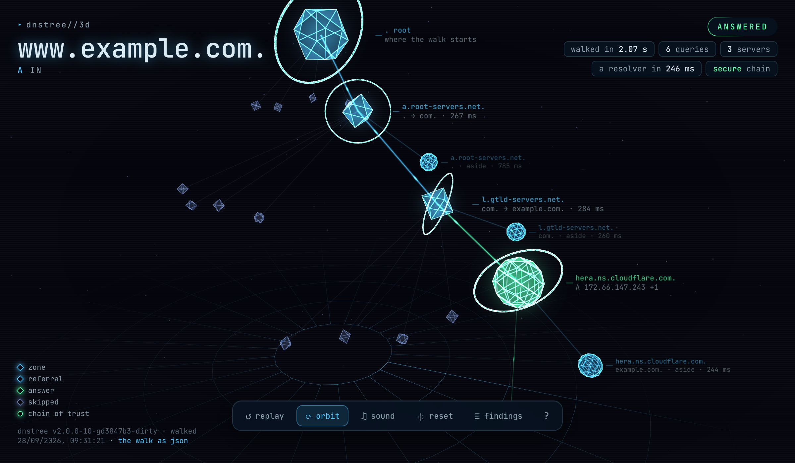
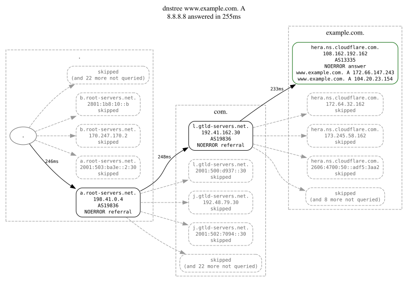
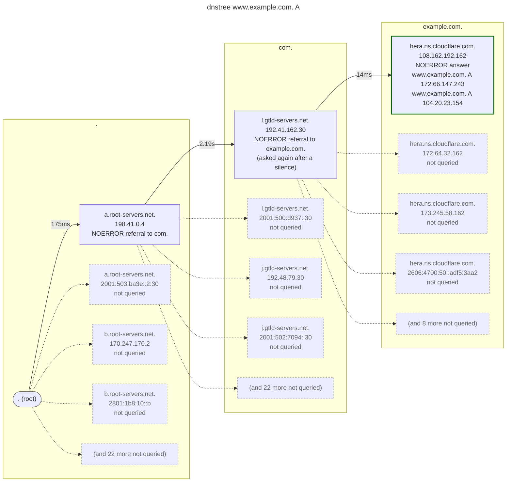

# Reading a walk

What the walk says in sentences, and the ways it can be drawn.

- [Saying what happened](#saying-what-happened)
- [Watching it happen](#watching-it-happen)
- [Where the time went](#where-the-time-went)
- [Other formats](#other-formats)
- [The bytes on the wire](#the-bytes-on-the-wire)
- [Walking it again](#walking-it-again)

## Saying what happened

`--explain` writes a handful of sentences under the tree: what the walk came
to, how long it goes on being served after it changes, what the chain of trust
made of it, whether a name points at something nobody holds, what the zone's
nameservers have in common, which servers made it harder, and whether a
recursive resolver agreed.

```
$ dnstree --explain www.example.com
...
✔ answered in 758ms · resolver in 261ms · 3 queries · 3 servers

· www.example.com. A is 104.20.23.154 and 172.66.147.243, answered by hera.ns.cloudflare.com. for example.com.
· a cache may hold this answer for 5 minutes, and the delegation to example.com. for 2 days
```

That second line is the one a change window turns on. Every TTL it reads is one
the walk already recorded — the answer carries its own, the referral above it
carries the parent's — and the two are usually days apart: changing a record is
over in minutes, changing the nameservers that serve it is not. A name that is
not there has no records to carry a lifetime, so the zone's SOA says how long
being denied lasts instead, the shorter of the two fields that can say it.

The resolver the walk is timed against says the other half, where it has
something to say: an answer it had to go and fetch comes back with the zone's
lifetime entire, and one it is serving out of its own cache comes back with
less.

```
$ dnstree --explain www.iana.org
...
✔ answered in 1.6s · resolver in 252ms · 6 queries · 5 servers

· www.iana.org. A is 104.18.24.232 and 104.18.25.232, answered by ns1.cloudflare.net. for cloudflare.net., after 1 alias
· a cache may hold this answer for 5 minutes, and the delegation to cloudflare.net. for 2 days
· 8.8.8.8 is answering this from its cache, with 4 minutes 57 seconds left on the copy it is serving
```

Every sentence is read off the trace the walk recorded, and nothing is worked
out a second time, so the sentences and the tree above them cannot come to
disagree. It is the same reason none of them claims more than the walk checked:
a chain this build could not check reads as unchecked, never as broken.

```
$ dnstree --dnssec --explain dnssec-failed.org
...
✘ bogus in 4.5s · resolver in 453ms (SERVFAIL) · 12 queries · 5 servers

· dnssec-failed.org. A is 96.99.227.255, answered by dns101.comcast.net. for dnssec-failed.org.
· a cache may hold this answer for 5 minutes, and the delegation to dnssec-failed.org. for 1 hour
· the chain of trust breaks at dnssec-failed.org.: no DNSKEY of the zone matches the DS its parent published, so a resolver that validates answers SERVFAIL for this name
```

They are for the walk you did not draw yourself — a paste from somebody else, a
run out of a script — and they leave the exit code alone.

What the nameservers of a zone have in common is what it can lose the whole of
at once, so that is read too — but only as far as the walk went. A walk asks one
nameserver of a zone and lists the rest, and the origin AS of a nameserver
nobody asked is never looked up, so it takes `--all` to say anything about the
set:

```
$ dnstree --all --explain www.example.com
...
✔ answered in 1.9s · resolver in 15ms · 64 queries · 64 servers

· www.example.com. A is 104.20.23.154 and 172.66.147.243, answered by elliott.ns.cloudflare.com. for example.com.
· a cache may hold this answer for 5 minutes, and the delegation to example.com. for 2 days
· all 2 nameservers of example.com. are in AS13335, so one operator's outage takes the whole zone with it
```

A set that is not all accounted for is not held against itself: a nameserver
that was never asked, or one the AS lookups did not answer for, leaves the whole
question unanswered rather than half answered. The address families are read off
the parent's glue instead, which is whole whether or not the servers were asked,
so a zone with no IPv4 anywhere in its delegation is named without `--all`.

A name left pointing at something that is not there can be taken over by whoever
creates that thing first, without touching the owner's account. Three kinds
are said, and the hop that showed each is marked `dangling` in the tree:

- a nameserver whose name does not exist. The name that is missing is the one
  directly below the zone that denied it, so `ns1.gone.com` denied by `com.`
  names `gone.com` as the domain whoever registers it can answer with;
- an alias whose target does not exist, in a zone other than the alias's own,
  such as a cloud resource deleted from under a `CNAME`;
- a zone every one of whose nameservers answered without authority for it,
  which is how a hosting service answers for a zone nobody has created there.

A denial says nothing about the names above the one denied, so where the
missing name is deeper than the one below the zone, that name is asked of the
same server too. If it exists, only whoever holds it can create what is
missing, and nothing is said.

None of them is a claim that the name can be taken, only what the walk saw:
a zone halfway through a move looks the same, and so does a service that does
not let strangers in. No list of risky services is carried, since it would go
stale. A walk stops looking up nameservers named outside a zone at the first
that has an address, so it takes `--all` to find a dangling one listed after it.

`--format json`, `dot`, `mermaid`, `waterfall-mermaid` and `openmetrics` refuse
`--explain`, `--diff` and `--against`: all five are read by a program, which
has the same facts in fields already.

## Watching it happen

`--live` redraws the tree in place as the walk makes it, so the referrals
arrive one at a time instead of all at once at the end. The hop that just
landed is pointed at, `└─▸`, so the eye finds it without reading the tree
again.

Under the tree sits the part that moves on its own, on a timer rather than on a
hop — here, half a second into a walk:

```
. (root)
├── a.root-servers.net. 198.41.0.4  244ms  NOERROR  referral → com.
│   └─▸ l.gtld-servers.net. 192.41.162.30  254ms  NOERROR  referral → example.com.
├── a.root-servers.net. 2001:503:ba3e::2:30  (not queried)
├── b.root-servers.net. 170.247.170.2  (not queried)
├── b.root-servers.net. 2801:1b8:10::b  (not queried)
└── (and 22 more not queried)
    ⠧ asking hera.ns.cloudflare.com. 108.162.192.162  example.com.  61ms

⠧  562ms · 3 queries · 3 servers · . → com. → example.com.
```

A query is named there from the moment it goes out until the moment it comes
back, which is what tells a walk waiting on a silent server apart from a walk
that has hung — nothing joins the tree until an answer does. The footer carries
the clock, what the walk has spent, and the zones it has come down through.

The frames are scratch: when the walk is over they are wiped and the finished
tree is written where they stood, which is exactly what a run without `--live`
prints, followed by one line saying how it went:

```
✔ answered in 718ms · resolver in 231ms · 3 queries · 3 servers
```

> [!NOTE]
> Off a terminal the flag does nothing, and it cannot be combined with any
> format but `tree`, `ascii` and `emoji`: the others are written once, at the
> end.

## Where the time went

The tree says how long each query took, but not when it was sent, what it had
to wait for, or what was in flight at the same moment. `--format waterfall` draws
the same walk as a timeline, one row per query, the way the network tab of a
browser draws a page loading: a bar from when the query went out to when the
last of its answers came back, every bar on the scale of the whole walk. The
asides, the work that answers some other question on the way, are drawn lighter
than the walk's own queries:

```
$ dnstree --dnssec --format waterfall www.github.com
                       0             2s            4s
a.root-servers.net.    ██                              258ms  referral → com.
a.root-servers.net.      ░░░░░░                        941ms  answer  DNSKEY .  (truncated over udp; DNSKEY of .)
l.gtld-servers.net.            ██                      263ms  referral → github.com.
l.gtld-servers.net.              ░░                    262ms  answer  DNSKEY com.  (DNSKEY of com.)
ns-421.awsdns-52.com.              ██                  244ms  cname
ns-421.awsdns-52.com.                ░░                246ms  no data  DNSKEY github.com.  (DNSKEY of github.com.)
a.root-servers.net.                    █               260ms  referral → com.  A github.com.
a.root-servers.net.                     ░░░░░░         790ms  answer  DNSKEY .  (truncated over udp; DNSKEY of .)
l.gtld-servers.net.                           ██       266ms  referral → github.com.  A github.com.
l.gtld-servers.net.                             ░░     257ms  answer  DNSKEY com.  (DNSKEY of com.)
ns-421.awsdns-52.com.                             █    242ms  answer  A github.com.
ns-421.awsdns-52.com.                              ░░  241ms  no data  DNSKEY github.com.  (DNSKEY of github.com.)
✔ answered in 4.3s · resolver in 237ms · 12 queries · 3 servers
```

A slow server is a long bar, a retry after a silence is a long bar with
`(asked again after a silence)` beside it, and `--all` shows as bars stacked one
over the other. Here it is how the time goes in resolving an alias: the chain of
trust is followed again from the root for the name the alias points at, keys of
the root and all.

`--format waterfall-ascii` draws it with `#` and `.`, for pasting into
documents, and `--format waterfall-mermaid` writes it as a Mermaid gantt chart,
which GitHub draws in a fenced `mermaid` block. The page `--format web` serves
draws the same timeline under its timing tab.

```mermaid
---
title: "dnstree www.github.com. A"
---
gantt
    dateFormat x
    axisFormat %S.%L s
    todayMarker off
    section .
    a.root-servers.net. referral to com.:0, 258
    a.root-servers.net. answer, DNSKEY .:done, 257, 1198
    section com.
    l.gtld-servers.net. referral to github.com.:1198, 1462
    l.gtld-servers.net. answer, DNSKEY com.:done, 1461, 1723
    section github.com.
    ns-421.awsdns-52.com. cname:1724, 1969
    ns-421.awsdns-52.com. no data, DNSKEY github.com.:done, 1969, 2215
    section .
    a.root-servers.net. referral to com., A github.com.:2215, 2476
    a.root-servers.net. answer, DNSKEY .:done, 2476, 3266
    section com.
    l.gtld-servers.net. referral to github.com., A github.com.:3266, 3532
    l.gtld-servers.net. answer, DNSKEY com.:done, 3532, 3789
    section github.com.
    ns-421.awsdns-52.com. answer, A github.com.:active, 3791, 4034
    ns-421.awsdns-52.com. no data, DNSKEY github.com.:done, 4034, 4275
```

<details>
<summary>The same walk, as GitHub draws it</summary>



</details>

Each query records when it went out, as `start_ms` in `--format json`, so a
walk drawn again with `--from` keeps its timeline. A walk saved before dnstree
kept that has none to draw: all three waterfall formats refuse it, and the tree
still draws it.

## Other formats

`--format emoji` tells the same walk in emoji — a 🛰️ for a referral, a 🎯 for
the answer, a 💤 for a server nobody asked, ⚡ and 🐢 for the fast and the slow.
It pairs well with `--live`.

<details>
<summary>The same walk, in emoji</summary>

```
$ dnstree --format emoji --live www.example.com
🌍  . (root)
├── 🛰️  a.root-servers.net. 198.41.0.4  AS19836  248ms  NOERROR  referral → com.
│   ├── 🛰️  l.gtld-servers.net. 192.41.162.30  AS19836  251ms  NOERROR  referral → example.com.
│   │   ├── 🎯  hera.ns.cloudflare.com. 108.162.192.162  AS13335  236ms  NOERROR  AA
│   │   │   ├── 📍 www.example.com. 300 A 172.66.147.243
│   │   │   └── 📍 www.example.com. 300 A 104.20.23.154
│   │   ├── 💤  hera.ns.cloudflare.com. 172.64.32.162  (not queried)
│   │   ├── 💤  hera.ns.cloudflare.com. 173.245.58.162  (not queried)
│   │   ├── 💤  hera.ns.cloudflare.com. 2606:4700:50::adf5:3aa2  (not queried)
│   │   └── 💤  (and 8 more not queried)
│   ├── 💤  l.gtld-servers.net. 2001:500:d937::30  (not queried)
│   ├── 💤  j.gtld-servers.net. 192.48.79.30  (not queried)
│   ├── 💤  j.gtld-servers.net. 2001:502:7094::30  (not queried)
│   └── 💤  (and 22 more not queried)
├── 💤  a.root-servers.net. 2001:503:ba3e::2:30  (not queried)
├── 💤  b.root-servers.net. 170.247.170.2  (not queried)
├── 💤  b.root-servers.net. 2801:1b8:10::b  (not queried)
└── 💤  (and 22 more not queried)
✔ answered in 749ms · resolver in 11ms · 3 queries · 3 servers
```

</details>

`--format markdown` writes the walk as a report to paste into a ticket, an
incident write-up or a pull request: a heading that says what it came to and
when it was made, the tree and its summary in a code fence, the sentences
`--explain` would write, and a table of what the resolvers answered. It always
explains; `--diff` and `--against` add what changed. Everything a server wrote
is escaped, so a name or a record cannot open a link, mention anybody or start
a table cell of its own. With `--from`, a walk saved during an incident becomes
a report afterwards.

<details>
<summary>A report, as it is pasted</summary>

````
$ dnstree --format markdown --dnssec www.example.com
### `www.example.com. A`: answered, secure

walked on 2026-09-30 21:05 UTC

```
. (root)  [secure RSASHA256/SHA256]
├── a.root-servers.net. 198.41.0.4  AS19836  258ms  1175 of 1232 bytes  NOERROR  DO  referral → com.  [secure ECDSAP256SHA256/SHA256]
│   ├── a.root-servers.net. 198.41.0.4  AS19836  782ms  NOERROR  AA DO  (truncated over udp; DNSKEY of .)
│   ├── l.gtld-servers.net. 192.41.162.30  AS19836  259ms  NOERROR  DO  referral → example.com.  [secure ECDSAP256SHA256/SHA256]
│   │   ├── l.gtld-servers.net. 192.41.162.30  AS19836  255ms  NOERROR  AA DO  (DNSKEY of com.)
│   │   ├── hera.ns.cloudflare.com. 108.162.192.162  AS13335  242ms  NOERROR  AA DO  [secure ECDSAP256SHA256]
│   │   │   ├── www.example.com. 300 A 172.66.147.243
│   │   │   ├── www.example.com. 300 A 104.20.23.154
│   │   │   └── hera.ns.cloudflare.com. 108.162.192.162  AS13335  231ms  NOERROR  AA DO  (DNSKEY of example.com.)
│   │   ├── hera.ns.cloudflare.com. 172.64.32.162  (not queried)
│   │   ├── hera.ns.cloudflare.com. 173.245.58.162  (not queried)
│   │   ├── hera.ns.cloudflare.com. 2606:4700:50::adf5:3aa2  (not queried)
│   │   └── (and 8 more not queried)
│   ├── l.gtld-servers.net. 2001:500:d937::30  (not queried)
│   ├── j.gtld-servers.net. 192.48.79.30  (not queried)
│   ├── j.gtld-servers.net. 2001:502:7094::30  (not queried)
│   └── (and 22 more not queried)
├── a.root-servers.net. 2001:503:ba3e::2:30  (not queried)
├── b.root-servers.net. 170.247.170.2  (not queried)
├── b.root-servers.net. 2801:1b8:10::b  (not queried)
└── (and 22 more not queried)
✔ answered in 2s · resolver in 251ms · 6 queries · 3 servers
```

**what happened**

- www.example.com. A is 104.20.23.154 and 172.66.147.243, answered by hera.ns.cloudflare.com. for example.com.
- a cache may hold this answer for 5 minutes, and the delegation to example.com. for 2 days
- the chain of trust holds from the root to example.com., signed with ECDSAP256SHA256
- ⚠ 1 server answered with almost nothing left of the datagram the answer had to fit in (a.root-servers.net. with 1175 of 1232 bytes), so one more record in the zone truncates it, and every resolver that asks then pays a second round trip over TCP for the whole of it

**resolvers**

| resolver | answer | time |
| --- | --- | --- |
| 8.8.8.8 | agrees | 251ms |
````

</details>

`--format web` draws nothing in the terminal at all. It serves the finished walk
as a page on this machine and opens a browser at it:

```
$ dnstree --format web --dnssec www.example.com
        ⣶⡄  ⢀⣶
      ⢀ ⠈⢿⣆⣠⡿⠃⢀⣤⡀
    ⣀⡀⢿⣷⡀ ⣿⣿⠁⣠⣿⠟⣀⣀
    ⠉⠛⠳⢿⣿⣆⣿⣿⣼⡿⠟⠛⠋⠉   www.example.com. A · drawn as a page to read
        ⠈⢿⣿⣿⠟        the walk is at http://127.0.0.1:59981/
          ⣿⣿         served until ctrl-c
          ⣿⣿
          ⣿⣿⡆
         ⠸⠿⠿⠇
```

The page is the same walk with every hop worth clicking on — the records it
returned, the delegation it pointed at, what the server said about its own
answer — beside three other ways to read it: what each server cost, who the
addresses belong to grouped by origin AS, and the chain of trust cut by cut.
`--explain` and `--diff` put their sentences on the page rather than under a
tree. Nothing is fetched from anywhere: the page is in the binary, and the walk
behind it is served under `/trace.json`, byte for byte what `--format json`
writes.

It listens on `127.0.0.1` and a free port, and answers only a request that
reached it by address — a walk names the servers it asked and the addresses they
answered from, which is nobody else's business. `--web-addr :8080` moves it,
which is what a walk made on another machine needs, and says so in a line when
the address it was given is not this machine's alone. `--no-browser` leaves the
address to be opened by hand. On a terminal the address is a link it can click;
a pipe, or `--color never`, gets two plain lines instead, for a script to read
it from:

```
the walk is at http://127.0.0.1:59996/
it is served until this command is interrupted
```

`--format web-3d` serves the same walk the same way, and takes `--web-addr` and
`--no-browser` too, but draws it as a scene to turn around rather than a tree to
read:

```
$ dnstree --format web-3d --dnssec www.example.com
        ⣶⡄  ⢀⣶
      ⢀ ⠈⢿⣆⣠⡿⠃⢀⣤⡀
    ⣀⡀⢿⣷⡀ ⣿⣿⠁⣠⣿⠟⣀⣀
    ⠉⠛⠳⢿⣿⣆⣿⣿⣼⡿⠟⠛⠋⠉   www.example.com. A · drawn as a scene to turn around
        ⠈⢿⣿⣿⠟        the walk is at http://127.0.0.1:59983/
          ⣿⣿         served until ctrl-c
          ⣿⣿
          ⣿⣿⡆
         ⠸⠿⠿⠇
```

The hops float in a cone that opens downwards, one ring a zone cut, and the walk
assembles in the order it was made, each query taking as long in the replay as
its server took. The shape of a hop says what it came to, the rings round it are
the chain of trust at that cut, and the brighter trail is the way to the answer;
clicking a hop says what the server said. Queries the walk had out at once are
in flight at once, and the line over the controls holds the replay or winds it
back. A name left pointing at nothing hangs a snapped thread, and a server that
hands its zone or its recursion to strangers throws off sparks. `f` rides along
with the question, from the root down to the answer. When the answer arrives, a
bead runs back up the trail to the root. `c` films the replay, the name and the
labels with it, and saves the film: it is made in the browser and goes nowhere
else. Sound is off until asked for, and is placed where the hops are, so that
turning the scene turns it too. It is WebGL2 and nothing else: a browser without
it is pointed back at `--format web`, and one asking for reduced motion gets the
walk already assembled and standing still.



`--format ascii` swaps the branches for `` |-- `` and drops the colour, for
pasting into documents. `--format json` writes a versioned document with
durations in milliseconds, every hop carrying the question it put: a walk asks
for a good deal more than the name it was given — the keys of each zone, the NS
set a zone holds of itself, the serial each of its servers is on — and `asked`
is how a program tells those apart from the resolution itself, where a person
reads the note beside them. `--format dot` writes a Graphviz graph, one node per
query, clustered by zone:

```
dnstree --format dot www.example.com | dot -Tsvg > trace.svg
```



`--format mermaid` draws the same picture for the places that draw Mermaid
rather than Graphviz: pasted into a fenced `mermaid` block, GitHub, GitLab and
most wikis draw it where it stands, which makes it the one to put in an issue.
Whatever a server wrote is escaped on the way, so a record cannot close a label
or open a tag on the page it lands on.

<details>
<summary>The same walk, as GitHub draws it</summary>



</details>

`--schema` prints the JSON Schema of that document and stops, so whatever reads
the output can be held against the shape of it — and told what a field means —
without reading the source:

```
dnstree --schema > trace.schema.json
dnstree --format json www.example.com | check-jsonschema --schemafile trace.schema.json -
```

It describes one version of the shape, the one the binary it came out of
writes. `schema_version` is raised whenever a field changes meaning or goes
away, never for one that is merely added, so nothing in the schema forbids
properties it does not name: a reader that understands a version keeps
understanding it.

The same schema is served at
[rafaeljusto.github.io/dnstree/trace.schema.json](https://rafaeljusto.github.io/dnstree/trace.schema.json),
which is the address its `$id` names, so a validator can be pointed at it with
no binary to hand.

## The bytes on the wire

`--pcap FILE` writes every query the walk sent, and every answer that came back,
as a packet capture that Wireshark and `tcpdump -r` read. It is for when the tree
is not enough: a strange flag, an option, a record type dnstree does not
decode. No second terminal, no root and no filter are needed, and nothing
else on the machine ends up in it.

```
$ dnstree --pcap walk.pcap www.example.com
$ tcpdump -nn -r walk.pcap
reading from file walk.pcap, link-type RAW (Raw IP)
12:37:24.058246 IP 192.0.2.1.49153 > 198.41.0.4.53: 14133 [1au] A? www.example.com. (44)
12:37:24.305576 IP 198.41.0.4.53 > 192.0.2.1.49153: 14133- 0/13/27 (840)
12:37:24.306017 IP 192.0.2.1.49154 > 192.41.162.30.53: 31959 [1au] A? www.example.com. (44)
12:37:24.557488 IP 192.41.162.30.53 > 192.0.2.1.49154: 31959- 0/2/13 (363)
12:37:24.557587 IP 192.0.2.1.49155 > 108.162.192.162.53: 52117 [1au] A? www.example.com. (44)
12:37:24.793016 IP 108.162.192.162.53 > 192.0.2.1.49155: 52117*- 2/0/1 A 172.66.147.243, A 104.20.23.154 (76)
```

The capture is rebuilt, not taken off the wire. The DNS messages are the bytes
that were sent and received, and the servers, ports and times are real. The IP,
UDP and TCP headers around them are made up, though. dnstree's side is written as
`192.0.2.1` or `2001:db8::1` on a made-up port, so a capture pasted into a ticket
says nothing about the machine it was made on. A query over TCP is drawn as a
connection of its own, handshake included, so Wireshark puts the stream back
together.

Every query the walk sends goes in, retries and the `--check-*` probes included:
a query nobody answered appears without a reply, and so does one whose answer
did not read as DNS or was to another question, since that answer never made
it past dnstree. One whose connection was never made does not appear at all. The question timed against a resolver and
the origin AS lookups are not part of the walk and stay out. Every walk of the
run goes into the one file, which is written over.

`--dot` and `--doh` are refused. What crossed the wire there was TLS, and plain
DNS on port 853 or 443 would misrepresent it. `--from` has nothing to capture,
and `--watch` would hold every round in memory until it was interrupted, so
both are refused too. The file of defaults cannot set `--pcap`: a default that
writes a file over on every run is a trap.

## Walking it again

`--replay FILE` makes the walk again from a capture `--pcap` made, with every
server answering what it answered then. Nothing is sent. It is how a problem
seen from one network, or on one day, can be looked at somewhere else, later:
send the capture with a bug report, or try a newer dnstree on a walk that
failed last month.

```
$ dnstree --dnssec --pcap walk.pcap www.example.com
$ dnstree --dnssec --replay walk.pcap www.example.com
. (root)  [secure RSASHA256/SHA256]
├── a.root-servers.net. 198.41.0.4  310ms  1175 of 1232 bytes  NOERROR  DO  referral → com.  [secure ECDSAP256SHA256/SHA256]
│   ├── a.root-servers.net. 198.41.0.4  834ms  NOERROR  AA DO  (truncated over udp; DNSKEY of .)
│   ├── l.gtld-servers.net. 192.41.162.30  246ms  NOERROR  DO  referral → example.com.  [secure ECDSAP256SHA256/SHA256]
│   │   ├── l.gtld-servers.net. 192.41.162.30  240ms  NOERROR  AA DO  (DNSKEY of com.)
│   │   ├── hera.ns.cloudflare.com. 108.162.192.162  226ms  NOERROR  AA DO  [secure ECDSAP256SHA256]
│   │   │   ├── www.example.com. 300 A 104.20.23.154
│   │   │   ├── www.example.com. 300 A 172.66.147.243
│   │   │   └── hera.ns.cloudflare.com. 108.162.192.162  221ms  NOERROR  AA DO  (DNSKEY of example.com.)
│   │   ├── hera.ns.cloudflare.com. 172.64.32.162  (not queried)
│   │   ├── hera.ns.cloudflare.com. 173.245.58.162  (not queried)
│   │   ├── hera.ns.cloudflare.com. 2606:4700:50::adf5:3aa2  (not queried)
│   │   └── (and 8 more not queried)
│   ├── l.gtld-servers.net. 2001:500:d937::30  (not queried)
│   ├── j.gtld-servers.net. 192.48.79.30  (not queried)
│   ├── j.gtld-servers.net. 2001:502:7094::30  (not queried)
│   └── (and 22 more not queried)
├── a.root-servers.net. 2001:503:ba3e::2:30  (not queried)
├── b.root-servers.net. 170.247.170.2  (not queried)
├── b.root-servers.net. 2801:1b8:10::b  (not queried)
└── (and 22 more not queried)
✔ answered in 2.1s · 6 queries · 3 servers
```

Each hop keeps the time its answer took when the capture was made, and so
does the walk: the line at the bottom, and the waterfall, count the capture's
time rather than the replay's, which takes a millisecond. Signatures and
trust anchors are judged as of the moment the capture was made, so a signed
walk replayed after its signatures ran out still reads as it did then.

The walk is made afresh, not read back: a query is matched to the one in the
capture put the same way, to the same server, over the same protocol, with the
same EDNS options and DO bit. Answers to the same query come back in the order
they came, so a silence and then the answer to the retry happen again. A query
the capture holds no reply to comes back as a silence, whether the server said
nothing, reset the connection or sent what dnstree could not read: the capture
does not say which. A question the capture does not hold at all fails its hop
and says so, rather than being made up:

```
$ dnstree --replay walk.pcap www.example.com AAAA | tail -3
└── m.root-servers.net. 2001:dc3::35  error: udp [2001:dc3::35]:53: the capture holds no answer to www.example.com. AAAA asked this way
warning: no server answered for .
✘ no answer in 0s · 26 queries · 26 servers
```

So flags that change what is asked, like `--qmin`, `--all`, `--check` or
another type, get no further than the first query the capture lacks, unless
the capture was made with them too. Flags that only change how the walk is
drawn, like `--explain` or a `--format`, work as they always do.

Nothing outside the walk is asked. The comparison with a resolver and the
origin AS lookups are off, and `--rdap`, `--spf`, `--tlsa`, `--resolver`,
`--ddr`, `--check-resolver` and `--report` are refused, as are `--dot` and
`--doh`, which a capture of plain DNS holds nothing for. So are `--watch`,
since a replay answers the same
every time, and `--diff`, which would remember an old walk as the latest. Only
a capture `--pcap` wrote can be replayed, not one taken with tcpdump, and the
file of defaults cannot set `--replay`.

> [!WARNING]
> A capture holds every answer whole, not just what the tree draws: the
> names, addresses and records of every zone on the way. Read it with
> `tcpdump -r` before attaching it somewhere public.
